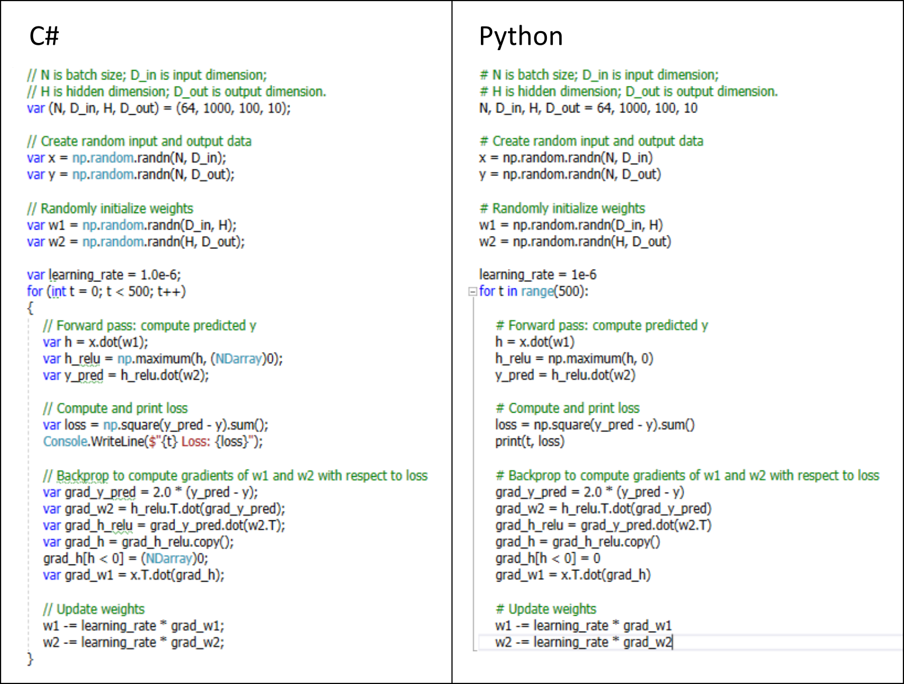
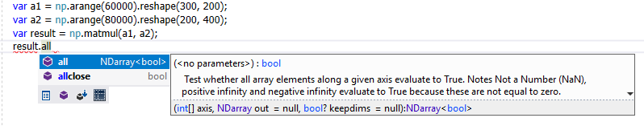

<a href="http://scisharpstack.org"></a>

**Numpy.NET** is the most complete .NET binding for [NumPy](https://www.numpy.org/), which is a fundamental library for scientific computing, machine learning and AI in Python. Numpy.NET empowers .NET developers with extensive functionality including multi-dimensional arrays and matrices, linear algebra, FFT and many more via a compatible strong typed API. Several other SciSharp projects like [Keras.NET](https://github.com/SciSharp/Keras.NET) and [Torch.NET](https://github.com/SciSharp/Torch.NET) depend on Numpy.NET. 

## Example

Check out this example which uses `numpy` operations to fit a two-layer neural network to random data by manually implementing the forward and backward passes through the network.



Numpy and Intellisense: a developer-friendly combination:



## Installation
If you want to use Numpy.NET you have two options:

### Numpy.dll
Just reference [Numpy.dll](https://www.nuget.org/packages/Numpy/) via Nuget, set your **build configuration to x64** and you are good to go. Thanks to [Python.Included](https://github.com/henon/Python.Included) it doesn't require a local Python installation or will not clash with existing installations. 

### Numpy.Bare.dll 
In certain use cases you might not want the packaged Python and NumPy packages. In that case you reference [Numpy.Bare.dll](https://www.nuget.org/packages/Numpy.Bare/) via Nuget. Depending on the Numpy.Bare nuget version will need Python 3.5, 3.6 or 3.7 and Numpy 1.16 installed for it to work. The first two digits of the Numpy.Bare version indicate which Python version is needed for it to run (i.e. Numpy.Bare v3.6.1.1 needs Python 3.6 installed). If you are getting BadImageFormatException switch between x86 and x64 build settings.

In other cases, you might want to control the install location of the Python installation or even set it up yourself instead of having the Numpy library do it. For those cases Numpy.Bare is also great. Check out the [custom installation example](https://github.com/SciSharp/Numpy.NET/tree/master/src/Examples/CustomInstallLocationExample) if you want to know how.

## How does it work?

Numpy.NET uses [Python for .NET](http://pythonnet.github.io/) to call into the Python module `numpy`. However, this does not mean that it depends on a local Python installation! Numpy.NET.dll uses [Python.Included](https://github.com/henon/Python.Included) which packages embedded Python 3.7 and automatically deploys it in the user's home directory upon first execution. On subsequent runs, it will find Python already deployed and therefore doesn't install it again. Numpy.NET also packages the NumPy wheel and installs it into the embedded Python installation when not yet installed. 

Long story short: as a .NET Developer **you don't need to worry about Python** at all. You just reference Numpy.NET, use it and **it will just work**, no matter if you have local Python installations or not.

## Multi-threading (Must read!)

**Beware: Not following these steps can result in deadlocks or access violation exceptions!**

Python/NumPy doesn't have real multi-threading support. There is no advantage in "simultaneously" executing `numpy` functions on multiple threads because `pythonnet` requires you to use the Global Interpreter Lock (GIL) to lock access to the Python engine exclusively for only one thread at a time. If you have to call Python from a thread other than the main thread you first must release the main thread's mutex by calling `PythonEngine.BeginAllowThreads()` or you'll have a deadlock: 

```csharp
var a = np.arange(1000);
var b = np.arange(1000);

// https://github.com/pythonnet/pythonnet/issues/109
PythonEngine.BeginAllowThreads();

Task.Run(()=> {
  // when running on different threads you must lock!
  using (Py.GIL())
  {
    np.matmul(a, b);
  }
}).Wait();
```
Above example only serves as a reference on how to call `numpy` from a different thread than the main thread. As said before, having multiple background threads that call into Python doesn't give you multi-core processing because of the requirement to lock the GIL. Not doing so will result in **access violation exceptions** and/or **deadlocks**. 

Note that you must call a method of `np` before calling `PythonEngine.BeginAllowThreads()` in order for the PythonEngine to be initialized. So, for instance, if you want to initialize an inherently multi-threaded .Net Core Web API at startup, do something like this:

```csharp
np.arange(1);
PythonEngine.BeginAllowThreads();
```
Also, if you do this, be sure to wrap any calls to Numpy in `using (Py.GIL()) { ... }` or else you'll get AccessViolationExceptions.

## Performance considerations

You might ask how calling into Python affects performance. As always, it depends on your usage. Don't forget that `numpy`'s number crunching algorithms are written in `C` so the thin `pythonnet` and `Python` layers on top won't have a significant impact if you are working with larger amounts of data. 

In my experience, calling `numpy` from C# is about 4 times slower than calling it directly in `Python` while the execution time of the called operation is of course equal. So if you have an algorithm that needs to call into `numpy` in a nested loop, Numpy.NET may not be for you due to the call overhead. 

All of `numpy` is centered around the `ndarray` class which allows you to pass a huge chunk of data into the `C` routines and let them execute all kinds of operations on the elements efficiently without the need for looping over the data. So if you are manipulating arrays or matrices with thousands or hundreds of thousands of elements, the call overhead will be negligible. 

The most performance sensitive aspect is creating an `NDarray` from a `C#` array, since the data has to be moved from the `CLR` into the `Python` interpreter. `pythonnet` does not optimize for passing large arrays from `C#` to `Python` but we still found a way to do that very efficiently. When creating an array with `np.array( ... )` we internally use `Marshal.Copy` to copy the entire `C#`-array's memory into the `numpy`-array's storage. And to efficiently retrieve computation results from `numpy` there is a method called `GetData<T>` which will copy the data back to `C#` in the same way:

```csharp
// create a 2D-shaped NDarray<int> from an int[]
var m = np.array(new int[] {1, 2, 3, 4});
// calculate the cosine of each element
var result = np.cos(m);
// get the floating point data of the result NDarray back to C#
var data = result.GetData<double>(); // double[] { 0.54030231, -0.41614684, -0.9899925 , -0.65364362 }
```

## Numpy.NET vs NumSharp

The SciSharp team is also developing a pure C# port of NumPy called [NumSharp](https://github.com/SciSharp/NumSharp) which is quite popular albeit being not quite complete.

There are a couple of other NumPy ports out there featuring subsets of the original library. The only one that matches Numpy.NET in terms of completeness is the IronPython package `numpy` which is out of date though. The SciSharp team is committed to keeping Numpy.NET up to date with the original library and to feature as much of the original functionality as possible.

## Code generation

The vast majority of Numpy.NET's code is generated using [CodeMinion](https://github.com/SciSharp/CodeMinion) by parsing the documentation at [docs.scipy.org/doc/numpy/](docs.scipy.org/doc/numpy/). This allowed us to wrap most of the `numpy`-API in just two weeks. The rest of the API can be completed in a few more weeks, especially if there is popular demand. 

### Completion status

The following API categories have been generated (if checked off)
 - [x] Array creation routines 
 - [x] Array manipulation routines
 - [x] Binary operations
 - [x] String operations
 - [x] Datetime Support Functions
 - [x] Data type routines
 - [x] Optionally Scipy-accelerated routines(numpy.dual)
 - [ ] Floating point error handling
 - [x] Discrete Fourier Transform(numpy.fft)
 - [x] Financial functions
 - [ ] Functional programming
 - [x] Indexing routines
 - [x] Input and output
 - [x] Linear algebra(numpy.linalg)
 - [x] Logic functions
 - [ ] Masked array operations
 - [x] Mathematical functions
 - [ ] Matrix library(numpy.matlib)
 - [ ] Miscellaneous routines
 - [x] Padding Arrays
 - [ ] Polynomials
 - [x] Random sampling(numpy.random)
 - [x] Set routines
 - [x] Sorting, searching, and counting
 - [x] Statistics
 - [x] Window functions
 
 Over 500 functions of all 1800 have been generated, most of the missing functions are duplicates on Matrix, Chararray, Record etc. 

### Auto-generated Unit-Tests

We even generated hundreds of unit tests from all the examples found on the NumPy documentation. Most of them don't compile without fixing them because we did not go so far as to employ a Python-To-C# converter. Instead, the tests are set up with a commented out Python-console log that shows what the expected results are and a commented out block of somewhat C#-ified Python code that doesn't compile without manual editing. 

Another reason why this process can not be totally automated is the fact that NumPy obviously changed the way how arrays are printed out on the console after most of the examples where written (they removed extra spaces between the elements). This means that oftentimes the results needs to be reformatted manually for the test to pass.

Getting more unit tests to run is very easy though, and a good portion have already been processed to show that Numpy.NET really works. If you are interested in working on the test suite, please join in and help. You'll learn a lot about NumPy on the way.

## Documentation

Since we have taken great care to make Numpy.NET as similar to NumPy itself, you can, for the most part, rely on the official [NumPy manual](https://docs.scipy.org/doc/numpy/). 

### Create a Numpy array from a C# array and vice versa

To work with data from C# in Numpy it has to be copied into the Python engine by using `np.array(...)`. You get an NDarray that you can use for further processing of the data. Here we calculate the square root:

```csharp
// create an NDarray from a C# array
var a = np.array(new[] { 2, 4, 9, 25 });
Console.WriteLine("a: "+ a.repr);
// a: array([ 2,  4,  9, 25])
// apply the square root to each element
var roots = np.sqrt(a);
Console.WriteLine(roots.repr);
// array([1.41421356, 2.        , 3.        , 5.        ])
```

After processing the data you can copy it back into a C# array use `a.GetData<int>()`, but be aware of the datatype of the NDarray in order to get correct values back:

```csharp
// Copy the NDarray roots into a C# array from NDarray (incorrect datatype)
Console.WriteLine(string.Join(", ", roots.GetData<int>()));
// 1719614413, 1073127582, 0, 1073741824 
Console.WriteLine("roots.dtype: " + roots.dtype);
// roots.dtype: float64
Console.WriteLine(string.Join(", ", roots.GetData<double>()));
// 1.4142135623731, 2, 3, 5
```

### Creating multi-dimensional NDarrays from C# arrays

Creating an `NDarray` from data is easy. Just pass the C# array into `np.array(...)`. You can pass 1D, 2D and 3D C# arrays into it. 

```csharp
// create a 2D NDarray
var m = np.array(new int[,] {{1, 2}, {3, 4}}); // the NDarray represents a 2 by 2 matrix
```

Another even more efficient way (saves one array copy operation) is to pass the data as a one-dimensional array and just reshape the NDarray. 

```csharp
// create a 2D NDarray
var m = np.array(new int[] {1, 2, 3, 4}).reshape(2,2); // the reshaped NDarray represents a 2 by 2 matrix
```

### Differences between Numpy.NET and NumPy

As you have seen, apart from language syntax and idioms, usage of Numpy.NET is almost identical to Python. However, due to lack of language support in C#, there are some differences which you should be aware of.

#### Array slicing syntax
You can access parts of an NDarray using [array slicing](https://docs.scipy.org/doc/numpy/reference/arrays.indexing.html#arrays-indexing). C# doesn't support the colon syntax in indexers i.e. `a[:, 1]`. However, by allowing to pass a string we circumvented this limitation, i.e. `a[":, 1"]`. Only the `...` operator is not yet implemented, as it is not very important. 

#### Variable argument lists
Some NumPy functions like `reshape` allow variable argument lists at the beginning of the parameter list. This of course is not allowed in C#, which supports a variable argument list only as the last parameter. In case of `reshape` the solution was to replace the variable argument list that specifies the dimensions of the reshaped array by a `Shape` object which takes a variable list of dimensions in its constructor: 

```csharp
var a=np.arange(24);
var b=np.reshape(a, new Shape(2, 3, 4)); // or a.reshape(2, 3, 4)
```

In other cases the problem was solved by providing overloads without the optional named parameters after the variable argument list. 

#### Parameter default values

C# is very strict about parameter default values which must be compile time constants. Also, parameters with default values must be at the end of the parameter list. The former problem is usually solved by having a default value of `null` instead of the non-compile-time constant and setting the correct default value inside the method body when called with a value of `null`. 

#### Unrepresentable operators
Python operators that are not supported in C# are exposed as instance methods of `NDarray`:

| Python | C# |
| ------ | ------ |
| //     | floordiv() |
| **     | pow() |


#### Inplace modification
In NumPy you can write `a*=2` which doubles each element of array `a`. C# doesn't have a `*=` operator and consequently overloading it in a Python fashion is not possible. This limitation is overcome by exposing inplace operator functions which all start with an 'i'. So duplicating all elements of array `a` is written like this in C#: `a.imul(2);`. The following table lists all inplace operators and their pendant in C#

| Python | C# |
| ------ | ------ |
| +=     | iadd() |
| -=     | isub() |
| \*=    | imul() |
| /=     | idiv() or itruediv() |
| //=    | ifloordiv() |
| %=     | imod() |
| \*\*=  | ipow() |
| <<=    | ilshift() |
| >>=    | irshift() |
| &=     | iand() |
| \|=    | ior() |
| ^=     | ixor() |

#### (Possible) scalar return types
In NumPy a function like `np.sqrt(a)` can either return a scalar or an array, depending on the value passed into it. In C# we are trying to solve this by creating overloads for every scalar type in addition to the original function that takes an array and returns an array. This bloats the API however and hasn't been done for most functions and for some it isn't possible at all due to language limitations. The alternative is to cast value types to an array (NDarray can represent scalars too):

So a simple `root = np.sqrt(2)` needs to be written somewhat clumsily like this in C#: `var root = (double)np.sqrt((NDarray)2.0);` until overloads for every value type are added in time for your convenience. In any case, the main use case for NumPy functions is to operate on the elements of arrays, which is convenient enough:

```csharp
var a = np.arange(100); // => { 0, 1, 2, ... , 98, 99 }
var roots = np.sqrt(a); // => { 0.0, 1.0, 1.414, ..., 9.899, 9.950 }
```

#### Complex numbers
Numpy.NET supports complex numbers even though the notation in Python and C# is very different:
```python
>>> a = np.array([1+2j, 3+4j, 5+6j])
```
looks like this in C#
```c#
var a = np.array(new Complex[] { new Complex(1, 2), new Complex(3,4), new Complex(5,6), });
```
Access the real and imaginary components of a complex array via `a.real` and `a.imag` or copy the complex values of an ndarray into C# with `Complex[] c=a.GetData<Complex>();`.

#### Functions clashing with their class name
The function fft(...) in numpy.fft and random(...) in numpy.random had to be renamed because C#  doesn't allow a member to have the same name as its enclosing class. That's why in Numpy.NET these functions have been renamed with a trailing underscore like this: `np.fft.fft_(...)`

## Versions and Compatibility

Currently, Numpy.dll is targeting .NET Standard (on Windows) and packages the following binaries:
* Python 3.7: (python-3.7.3-embed-amd64.zip)
* NumPy 1.16 (numpy-1.16.3-cp37-cp37m-win_amd64.whl)

Numpy.Bare.dll is available for the Python versions 2.7, 3.5, 3.6 and 3.7 on Windows, Linux and MacOS on Nuget.

To make Numpy.dll support Linux a separate version of [Python.Included](https://github.com/henon/Python.Included) packaging linux binaries of Python needs to be made and a version of Numpy.dll that packages a linux-compatible NumPy wheel. If you are interested, you may work on this issue. 

## License

Numpy.NET packages and distributes `Python`, `pythonnet` as well as `numpy`. All these dependencies imprint their license conditions upon Numpy.NET. The C# wrapper itself is MIT License. 

* Python: [PSF License](https://docs.python.org/3/license.html)
* Python for .NET (pythonnet): [MIT License](http://pythonnet.github.io/LICENSE)
* NumPy: [BSD License](https://www.numpy.org/license.html#license)
* Numpy.NET: [MIT License](./LICENSE)

## Common Mistakes
* If you check `Prefer 32-bit` in your build config or build with `x86` instead of `Any CPU` Numpy.NET will crash with `BadFormatException`
* If you have insufficient folder permissions in AppData Numpy.NET might crash. You can specify a different installpath by setting `Installer.INSTALL_PATH = "<install path>";`
* If you get deadlocks (program hangs indefinitely) you should read the secton about multi-threading above!
* If you get AccessViolationExceptions you should read the secton about multi-threading above!

## Project Sponsors
* [JetBrains](https://www.jetbrains.com/?from=Numpy.NET)
